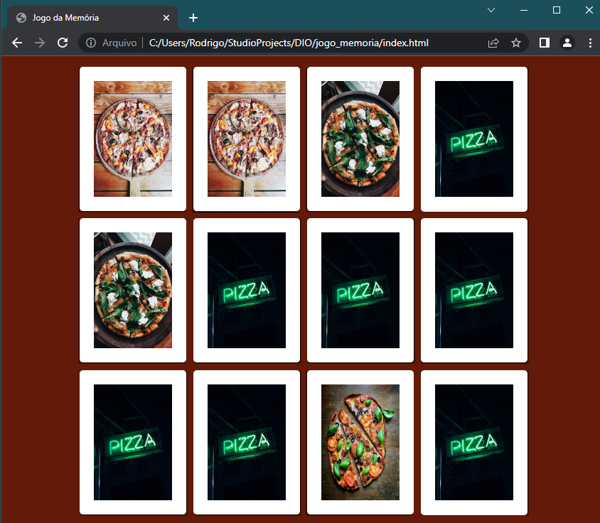

# Projeto HTML.

- Jogo da memória (html, css, js) **[repo](https://github.com/rodmantovani/gameHTML/tree/main/jogo_memoria)**

## Links:
[- Sintaxa básica de Markdown](https://www.markdownguide.org/basic-syntax/)
